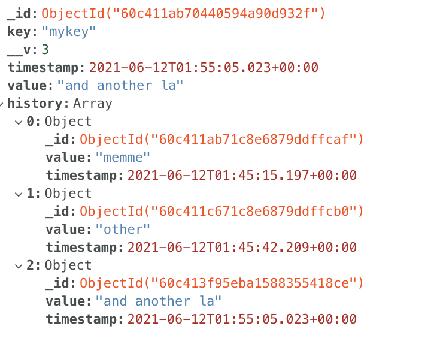

# VD Key Value Store API Description
A simple key-value store with a HTTP API interface that is able to:
1. Accept a key(string) and value(some json blob/string) ```{"key" : "value"}``` and store them. If
an existing key is sent, the value should be updated
2. Accept a key and return the corresponding latest value
3. When given a key AND a timestamp, return whatever the value of the key at the time was.


<br>

## Base URL: https://vd-key-value-store.herokuapp.com/vd-store

<br>

```
GET /
```

```
DESCRIPTION: Add given key/value pair to the store
POST /new  
Sample Request Body:
{
    "key": "myvalue"
}
Sample Response:
{
  "key": "key",
  "value": "myvalue",
  "timestamp": 1623484371
}
```

```
DESCRIPTION: Get the latest value associated to the given key
GET /:key
{
  "value": "myvalue",
}
```

```
DESCRIPTION: Get the value associated with the given :key and :timestamp. The value returned is based on the time nearest to the given :timestamp
GET /:key/:timestamp
{
  "value": "myvalue",
}
```

<br>

## Tech Stack
- Express server bootstrapped with express generator
- Mongoose ORM (MongoDB Atlas)


<br>

## DB 
Here is a snapshot of the MongoDB structure containing the latest key/value pair along with a history of modifications.




## Considerations for Improvement
* Use Swagger API for internal API documentation
* Code minification
* Add tests
* Consider using ESLint especially if multiple people working on the codebase
* Consier caching mechanism to avoid hitting DB for every request
* Defining route authentication/authorization policies
* Curently deployed on Heroku's free tier, however, this may not be favorable due to tier limitations/scalability. We may consider to choose a serverless deployment since we would pay only for what is used.
* For security, can consider using a package like `helmet`